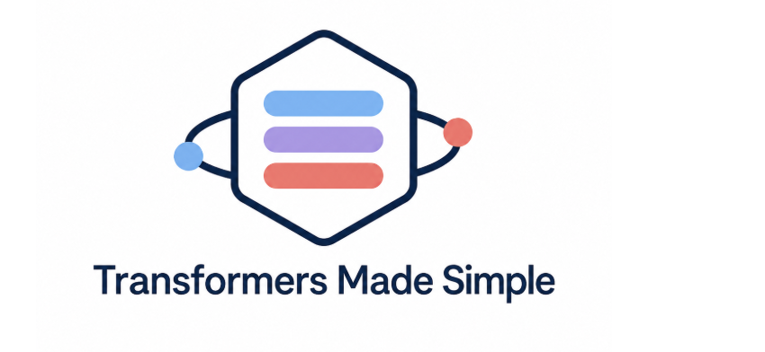

<div align="center">
  
</div>

A beginner-friendly PyTorch repository for learning the major Transformer families. The goal is not to reproduce an industrial training stack, but to make each architecture small, readable, runnable, and easy to modify.

Chinese documentation is available in [README_zh.md](README_zh.md).

## Project Layout

```text
modules/
  attention.py              multi-head attention and linear attention
  feedforward.py            standard MLP, SwiGLU, and MoE feed-forward layers
  positional_encoding.py    sinusoidal positions, learned positions, and RoPE
  embeddings.py             token embeddings and image patch embeddings
  normalization.py          LayerNorm and RMSNorm helpers
  masks.py                  causal masks and padding masks

models/
  encoder_only.py           BERT-style encoder-only Transformer
  decoder_only.py           GPT-style decoder-only Transformer
  encoder_decoder.py        encoder-decoder Transformer for seq2seq tasks
  vision_transformer.py     Vision Transformer (ViT)
  efficient_transformer.py  linear-attention Transformer example
  moe_transformer.py        Mixture-of-Experts Transformer
  multimodal_transformer.py text + image Transformer
  diffusion_transformer.py  DiT-style diffusion denoiser
  retrieval_transformer.py  retrieval-augmented Transformer
  hybrid_transformer.py     CNN + attention hybrid model

configs/                    small model configs
train/                      runnable toy training scripts
utils/                      sampling, checkpointing, and a tiny tokenizer
```

## Installation

Create a Python environment and install PyTorch:

```bash
pip install -r requirements.txt
```

For a CUDA-specific setup, see [ENVIRONMENT.md](ENVIRONMENT.md).

## Quick Start

Each model has its own training script. The scripts create tiny synthetic text, image, or multimodal datasets inside the file, so you can focus on the training loop and tensor shapes.

Encoder-only / BERT-style text classification:

```bash
python -m train.train_encoder_only
```

Decoder-only / GPT-style language modeling:

```bash
python -m train.train_decoder_only
```

Encoder-decoder / sequence reversal task:

```bash
python -m train.train_encoder_decoder
```

Vision Transformer / small image classification:

```bash
python -m train.train_vision_transformer
```

Efficient Transformer / longer text classification:

```bash
python -m train.train_efficient_transformer
```

MoE Transformer / expert-routed text classification:

```bash
python -m train.train_moe_transformer
```

Multimodal Transformer / text + image classification:

```bash
python -m train.train_multimodal_transformer
```

Diffusion Transformer / image denoising:

```bash
python -m train.train_diffusion_transformer
```

Retrieval Transformer / retrieval-conditioned language modeling:

```bash
python -m train.train_retrieval_transformer
```

Hybrid Transformer / CNN + attention text classification:

```bash
python -m train.train_hybrid_transformer
```

These scripts use short text snippets, random tokens, simple synthetic images, and tiny retrieval vectors. They are designed to teach how data enters each model, how the loss is computed, and how a training step works.

## Suggested Learning Path

1. Read `modules/attention.py` first to understand query, key, and value shapes.
2. Read `models/encoder_only.py` to see the basic self-attention + feed-forward + residual block.
3. Read `models/decoder_only.py` to understand causal masks and autoregressive prediction.
4. Read `models/encoder_decoder.py` to see how cross-attention lets a decoder read encoder outputs.
5. Explore ViT, MoE, DiT, multimodal, retrieval, and hybrid variants after the core pattern feels comfortable.

## Common Tensor Shapes

Text tokens:

```text
token_ids: (batch, seq_len)
hidden:    (batch, seq_len, dim)
logits:    (batch, seq_len, vocab_size)
```

Inside attention:

```text
q/k/v:     (batch, heads, seq_len, head_dim)
scores:    (batch, heads, query_len, key_len)
mask:      (batch, 1, query_len, key_len), or broadcastable to that shape
```

Image patches:

```text
images:    (batch, channels, height, width)
patches:   (batch, num_patches, dim)
```

## What To Try Next

- Replace the toy data with a real text dataset.
- Replace `CharTokenizer` with BPE or SentencePiece.
- Add a load-balancing loss to the MoE model.
- Add a KV cache to the decoder-only model for faster generation.
- Add a full diffusion scheduler to the DiT example.
